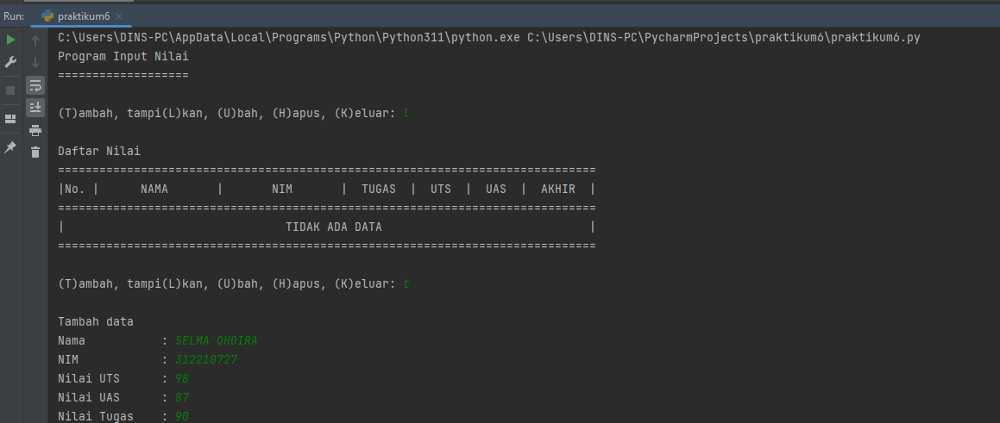
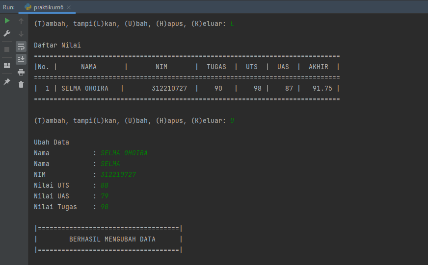
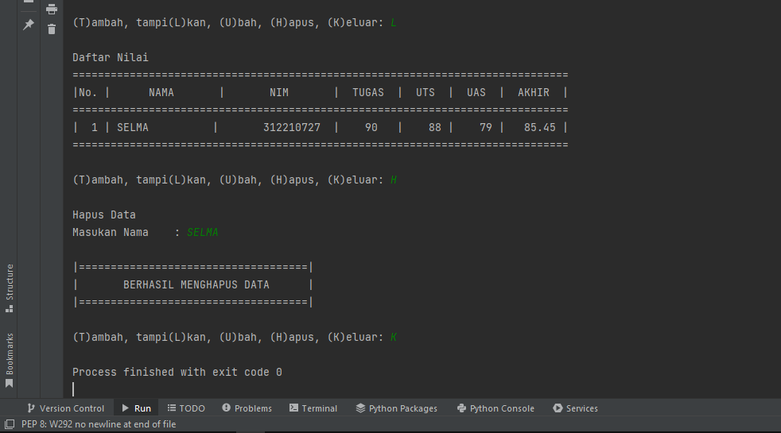

# Praktikum 6

NAMA        : Selma Ohoira

NIM         : 312210727

KELAS       : TI.22.C9

MATA KULIAH : Bahasa Pemograman

## Membuat program sederhana untuk membuat data mahasiswa menggunakan fungsi dan Dictionary dengan python.
1. Langkah pertama, membuat sebuah dictionary kosong yang nantinya akan diinputkan data ketika program dijalankan.
Masukan syntax berikut:

    x = {}

2. Selanjutnya membuat kondisi perulangan dan sebuah keterangan untuk pilihan menu yang akan menjalankan program.
Masukan syntax berikut:

    while True:
        c = input("\n(T)ambah, tampi(L)kan, (U)bah, (H)apus, (K)eluar: ")

3. Membuat fungsi "Tambah" untuk menambahkan data
Gunakan syntax berikut:

        def tambah():
            print("\nTambah data")
            nama = input("Nama           : ")
            nim = int(input("NIM            : "))
            uts = int(input("Nilai UTS      : "))
            uas = int(input("Nilai UAS      : "))
            tugas = int(input("Nilai Tugas    : "))
            akhir = tugas*30/100 + uts*35/100 + uas*35/100
            x[nama] = nim, tugas, uts, uas, akhir

4. Membuat fungsi "Ubah" untuk mengubah data
Gunakan syntax berikut:

        def ubah():
            print("\nUbah Data")
            nama = input("Nama           : ")
            if nama in x.keys():
                del x[nama]
                nama = input("Nama           : ")
                nim = int(input("NIM            : "))
                uts = int(input("Nilai UTS      : "))
                uas = int(input("Nilai UAS      : "))
                tugas = int(input("Nilai Tugas    : "))
                akhir = tugas*30/100 + uts*35/100 + uas*35/100
                x[nama] = nim, tugas, uts, uas, akhir
                print()
                print("|====================================|")
                print("|        BERHASIL MENGUBAH DATA      |")
                print("|====================================|")
            else:
                print("Nama {0} tidak ditemukan".format(nama))

5. Membuat fungsi "Hapus" untuk menghapus data.
Gunakan syntax berikut:

        def hapus():
            print("\nHapus Data")
            nama = input("Masukan Nama : ")
            if nama in x.keys():
                del x[nama]
                print()
                print("|====================================|")
                print("|       BERHASIL MENGHAPUS DATA      |")
                print("|====================================|")
            else:
                print("NIM {0} Tidak Ditemukan".format(nama))

6. Membuat fungsi "tampilkan" untuk menampilkan data (L)
Gunakan syntax berikut:

        def tampilkan():
            if x.items():
                print("\nDaftar Nilai")
                print("="*78)
                print("|No. |      NAMA       |       NIM       |  TUGAS  |  UTS  |  UAS  |  AKHIR  |")
                print("="*78)
                i = 0
                for z in x.items():
                    i += 1
                    print("| {no:2d} | {0:15s}| {1:15d}  | {2:5d}   | {3:5d} |{4:6d} | {5:7.2f} |"
                            .format(z[0][:13], z[1][0], z[1][1], z[1][2], z[1][3], z[1][4], no=i))
                print("=" * 78)
            else:
                print("\nDaftar Nilai")
                print("="*78)
                print("|No. |      NAMA       |       NIM       |  TUGAS  |  UTS  |  UAS  |  AKHIR  |")
                print("="*78)
                print("|                                TIDAK ADA DATA                              |")
                print("="*78)

7. Membuat syntax untuk memanggil fungsi
Gunakan syntax berikut:

        if c.lower() == 't':
                tambah()
            elif c.lower() == 'l':
                tampilkan()
            elif c.lower() == 'u':
                ubah()
            elif c.lower() == 'h':
                hapus()

8. Membuat fungsi "keluar", untuk keluar dari program atau menghentikan perulangan.
Gunakan syntax berikut:

        elif (c.lower() == 'k'):
            break

9. Menggunakan else
Digunakan apabila salah memasukkan pilihan inputan, gunakan syntax berikut :

        else:
            print("Pilih menu yang tersedia: ")

Jika kita menginputkan selain yang ada pada menu (t, u, h, c, l, k) maka kita akan diminta untuk memilih menu yang tersedia.

## Hasil akhir Praktikum 6

    x = {}

    def tambah():
        print("\nTambah data")
        nama = input("Nama           : ")
        nim = int(input("NIM            : "))
        uts = int(input("Nilai UTS      : "))
        uas = int(input("Nilai UAS      : "))
        tugas = int(input("Nilai Tugas    : "))
        akhir = tugas*30/100 + uts*35/100 + uas*35/100
        x[nama] = nim, tugas, uts, uas, akhir

    def tampilkan():
        if x.items():
            print("\nDaftar Nilai")
            print("="*78)
            print("|No. |      NAMA       |       NIM       |  TUGAS  |  UTS  |  UAS  |  AKHIR  |")
            print("="*78)
            i = 0
            for z in x.items():
                i += 1
                print("| {no:2d} | {0:15s}| {1:15d}  | {2:5d}   | {3:5d} |{4:6d} | {5:7.2f} |"
                        .format(z[0][:13], z[1][0], z[1][1], z[1][2], z[1][3], z[1][4], no=i))
            print("=" * 78)
        else:
            print("\nDaftar Nilai")
            print("="*78)
            print("|No. |      NAMA       |       NIM       |  TUGAS  |  UTS  |  UAS  |  AKHIR  |")
            print("="*78)
            print("|                                TIDAK ADA DATA                              |")
            print("="*78)
        
    def hapus():
        print("\nHapus Data")
        nama = input("Masukan Nama    : ")
        if nama in x.keys():
            del x[nama]
            print()
            print("|====================================|")
            print("|       BERHASIL MENGHAPUS DATA      |")
            print("|====================================|")
        else:
            print("NIM {0} Tidak Ditemukan".format(nama))

    def ubah():
        print("\nUbah Data")
        nama = input("Nama           : ")
        if nama in x.keys():
            del x[nama]
            nama = input("Nama           : ")
            nim = int(input("NIM            : "))
            uts = int(input("Nilai UTS      : "))
            uas = int(input("Nilai UAS      : "))
            tugas = int(input("Nilai Tugas    : "))
            akhir = tugas*30/100 + uts*35/100 + uas*35/100
            x[nama] = nim, tugas, uts, uas, akhir
            print()
            print("|====================================|")
            print("|        BERHASIL MENGUBAH DATA      |")
            print("|====================================|")
        else:
            print("Nama {0} tidak ditemukan".format(nama))

    print("Program Input Nilai")
    print("="*19)
    while True:
        c = input("\n(T)ambah, tampi(L)kan, (U)bah, (H)apus, (K)eluar: ")
        if c.lower() == 't':
            tambah()
        elif c.lower() == 'l':
            tampilkan()
        elif c.lower() == 'u':
            ubah()
        elif c.lower() == 'h':
            hapus()
        elif c. lower() == 'k':
            break
        else:
            print("Pilih menu yang tersedia")

SELESAI !!!